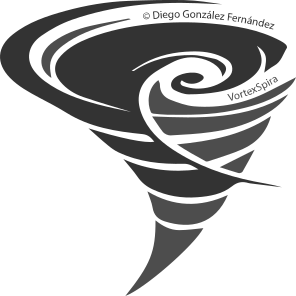

#  **VortexSpira® Universe**

Expositor de cursos de VortexSpira® e-learning mentor

---

## Enlaces de interés

* VortexSpira® Landing page: [https://subscribepage.io/vortexspira](https://subscribepage.io/vortexspira)
Hasta un 60% OFF en el pre-lanzamiento de todos los cursos, si te conviertes en fundador. Es totalmente gratis.

* VortexSpira® Dev Diary: [https://github.com/verogeid/vortexspira-devdiary](https://github.com/verogeid/vortexspira-devdiary)

* VortexSpira® Universe (🏗️): [https://www.vortexspira.com](https://www.vortexspira.com)

---

## 🛠️ Documentación Técnica

* **[Guía para el Mantenedor (Arquitectura y UI)](./MAINTAINER_DOCS.md)**: Documentación detallada sobre la estructura de archivos, el motor de renderizado SPA (Single Page Application), gestión de estados y directrices de Accesibilidad (A11y Nivel AAA).

---

## Licencia

Este expositor está registrado en Safe Creative y licenciado bajo:

[**🛡️ Safe Creative: Registro de Derechos**](https://www.safecreative.org)
[**🪪 Creative Commons BY-NC-ND 4.0 Internacional**](http://creativecommons.org/licenses/by-nc-nd/4.0/)

> El valor real de tu compra reside en el acceso a las actualizaciones y, sobre todo, en el derecho a obtener una **certificación a tu nombre** a través de Hotmart. Puedes usar el contenido en tus dispositivos y compartirlo, pero cualquier uso comercial o modificación requiere **acuerdo previo por escrito** con el autor.

---

© 2025 Diego González Fernández
[LinkedIn](https://www.linkedin.com/in/diego-gonzalez-fernandez)
