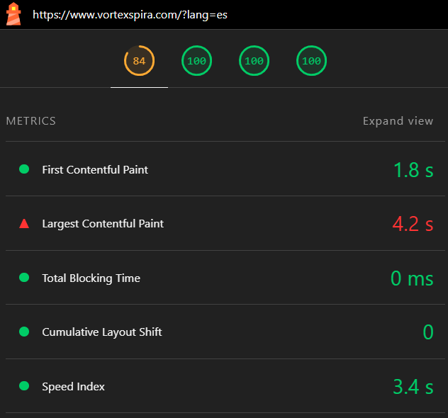
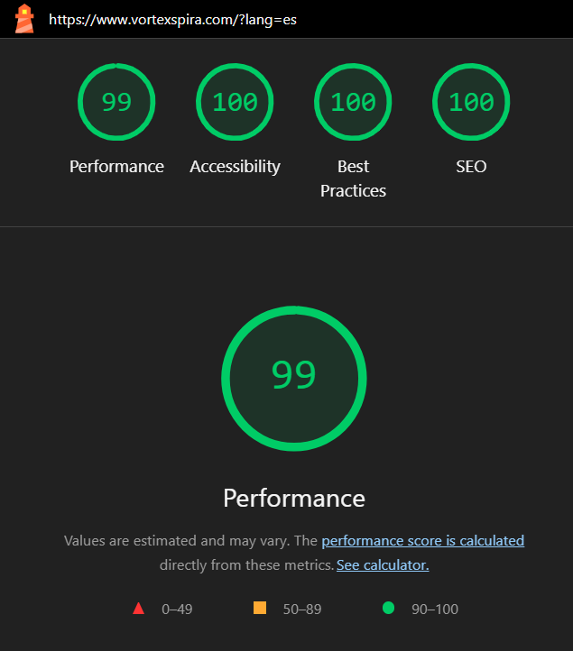
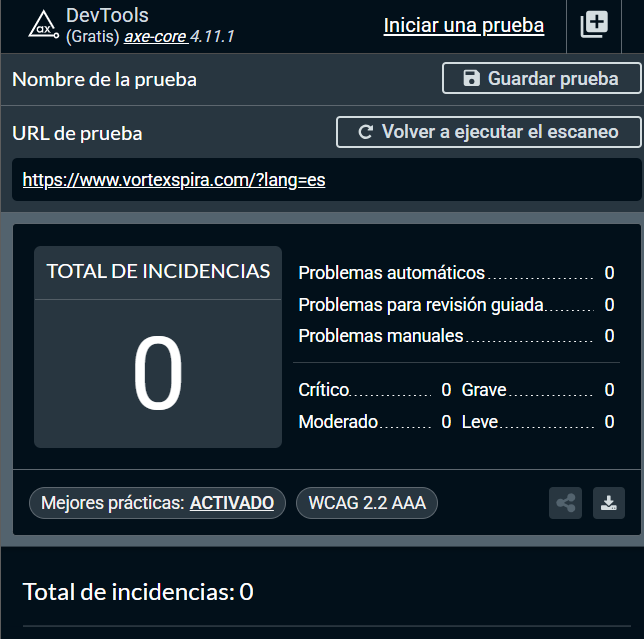

#  **VortexSpira® EdTech**

Expositor de cursos de VortexSpira® e-learning mentor. Una arquitectura diseñada para la excelencia técnica (0ms TBT) y la inclusión universal (WCAG 2.2 AAA).

---

## 🔗 Enlaces de interés

* **VortexSpira® Landing page:** [https://subscribepage.io/vortexspira](https://subscribepage.io/vortexspira)
* **VortexSpira® Dev Diary:** [https://github.com/verogeid/vortexspira-devdiary](https://github.com/verogeid/vortexspira-devdiary)
* **VortexSpira® EdTech (🏗️):** [https://www.vortexspira.com](https://www.vortexspira.com)

---

## 📊 Auditoría de Calidad (Entorno de Producción)

VortexSpira no es solo una plataforma de aprendizaje; es un compromiso de ingeniería. Estos son los resultados obtenidos en abril de 2026 tras auditorías híbridas (Manual + Axe-Core + Lighthouse + WebPageTest):

### 📱 Rendimiento Mobile
* **Performance:** 91/100 (Optimizado para redes estranguladas).
* **Total Blocking Time (TBT):** 0 ms (Determinismo total en la ejecución).
* **Accesibilidad, SEO & Buenas Prácticas:** 100/100

### 💻 Rendimiento Desktop
* **Performance:** 99/100
* **Accesibilidad, SEO & Buenas Prácticas:** 100/100

### 🛡️ Certificación de Accesibilidad WCAG 2.2 AAA
* **Resultado Axe-Core:** 0 problemas detectados.
* **Foco y DOM:** Gestión manual de nodos para garantizar la sincronización total con lectores de pantalla y eliminar errores de persistencia de scroll.

---

| **Lighthouse Mobile** | **Lighthouse Desktop** | **Axe-Core AAA** |
| :--- | :--- | :--- |
|  |  |  |

---

## 🏎️ Stress Test: Rendimiento en Hardware de Gama de Entrada (Mundo Real)

Para validar la resiliencia de la arquitectura de VortexSpira, se ha realizado una prueba de estrés desde **São Paulo (Brasil)** utilizando un **Android One** real (hardware de recursos limitados) sobre una red **4G (9 Mbps / 170ms RTT)**.

### Métricas Obtenidas (WebPageTest)
| Métrica | First View (Caché vacía) | Repeat View (Caché activa) |
| :--- | :--- | :--- |
| **Total Blocking Time (TBT)** | **90 ms** | **35 ms** |
| **Time to First Byte (TTFB)** | 0.546 s | 0.545 s |
| **Page Weight** | 287 KB | **128 B** |
| **Largest Contentful Paint (LCP)**| 5.733 s | 3.810 s |

### 🔍 Análisis de Ingeniería ("El Bisturí")

1. **Determinismo del Hilo Principal:** Lograr un **TBT de 90ms** (y 35ms en segunda carga) en un procesador tan modesto como el del Android One es la prueba irrefutable de que VortexSpira no genera "ruido" para el Garbage Collector. La interactividad es inmediata, respetando la CPU del usuario.
2. **Eficiencia de Entrega:** La reducción del peso de la página a **128 Bytes** en el Repeat View confirma una estrategia de caché en el Edge (Cloudflare) y cabeceras de control de activos impecables.
3. **Optimización del LCP (Roadmap):** El valor actual de LCP (5.7s) está penalizado por la inicialización del motor **Swiper** en la versión móvil actual y la latencia transatlántica. 

> **Nota Técnica Proactiva:** Basándonos en estas métricas, la **próxima versión del expositor eliminará el motor Swiper** en su versión mobile, sustituyéndolo por un flujo de **scroll vertical nativo con scroll-snap**. Esta evolución arquitectónica colapsará el LCP hacia los valores del TTFB, eliminando el tiempo de cálculo de JS y permitiendo un renderizado instantáneo del contenido crítico.

---

## 🛠️ Capacidades del Expositor (UX Inclusiva)

El expositor permite al usuario el control total sobre su entorno para mitigar la fatiga cognitiva y las barreras visuales:

* **Ingeniería Tipográfica:** Selección entre Atkinson Hyperlegible, Lexend o Serif. Escalado de fuente de 90% a 200% sin rotura de layout.
* **Control de Ritmo Visual:** Ajuste de espaciado interlineal, interparrafo y entre caracteres (Compacto a Muy Amplio).
* **Gestión Cromática Avanzada:** Modos Claro, Oscuro, Alto Contraste, Colores Forzados y Amarillo sobre Negro.
* **Seguridad Sensorial:** Desactivación global de animaciones y zonas de protección vestibular para evitar sobrecarga y mareos.
* **Resiliencia de Hardware:** Diseño full responsive con soporte garantizado en monitores de hasta 4000px.

---

## 📖 Documentación Técnica

* **[Guía para el Mantenedor (Arquitectura y UI)](./MAINTAINER_DOCS.md)**: Documentación detallada sobre la estructura de archivos, el motor de renderizado SPA, gestión de estados y directrices de accesibilidad.

---

## 💖 Apoya el desarrollo de VortexSpira

Como desarrollador independiente, dedico mi tiempo a perfeccionar una arquitectura que prioriza la ética sobre el beneficio rápido. Tu patrocinio me permite cubrir mis **gastos de vida y manutención**, dándome la estabilidad necesaria para seguir trabajando a tiempo completo en este ecosistema gratuito para alumnos y profesores de educación especial.

Tu apoyo financia directamente el tiempo de ingeniería senior necesario para mantener estos estándares sin compromisos.

> 

---

## Licencia

Este expositor está registrado en Safe Creative y licenciado bajo:

[**🛡️ Safe Creative: Registro de Derechos**](https://www.safecreative.org)
[**🪪 Creative Commons BY-NC-ND 4.0 Internacional**](http://creativecommons.org/licenses/by-nc-nd/4.0/)

> El valor real de tu compra reside en el acceso a las actualizaciones y, sobre todo, en el derecho a obtener una certificación a tu nombre a través de Hotmart. Cualquier uso comercial o modificación requiere acuerdo previo por escrito con el autor.

© 2026 Diego González Fernández
[LinkedIn](https://www.linkedin.com/in/diego-gonzalez-fernandez)
